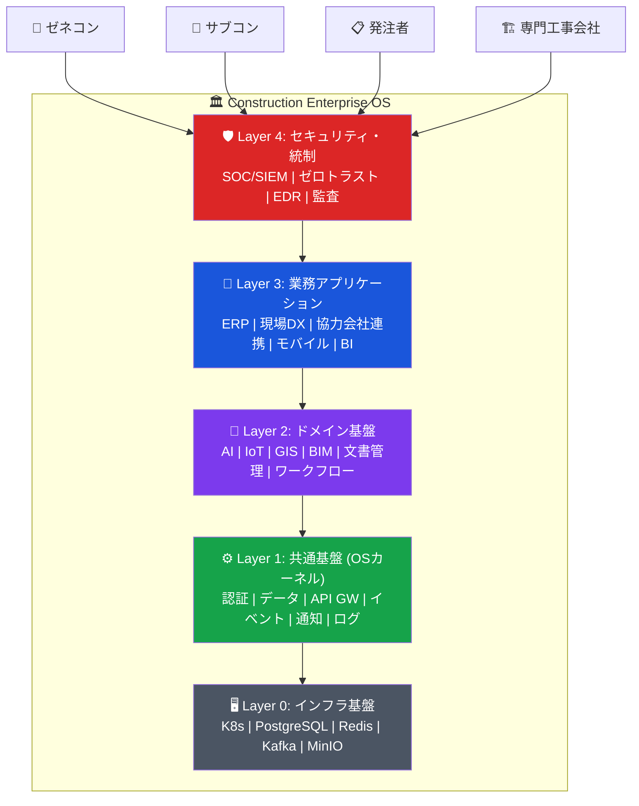
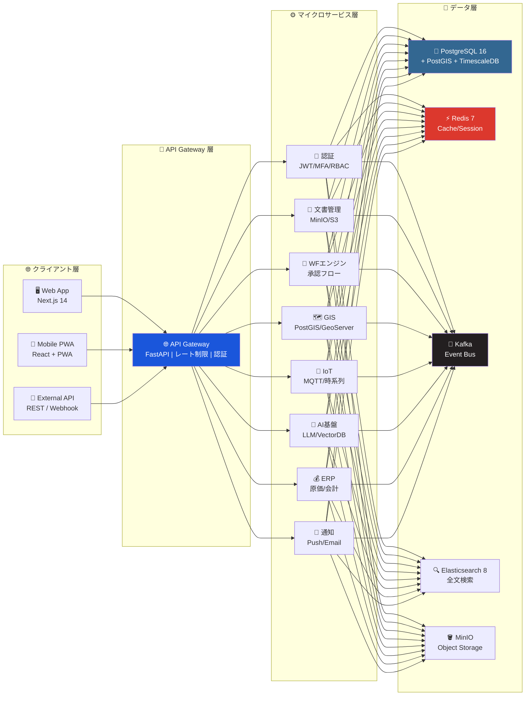
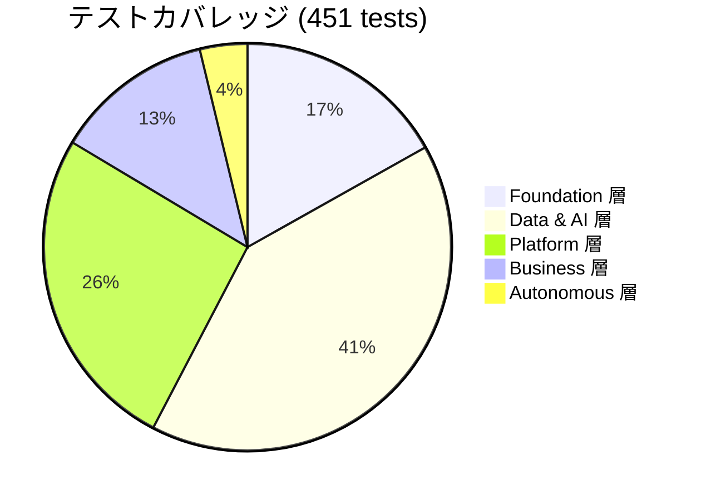
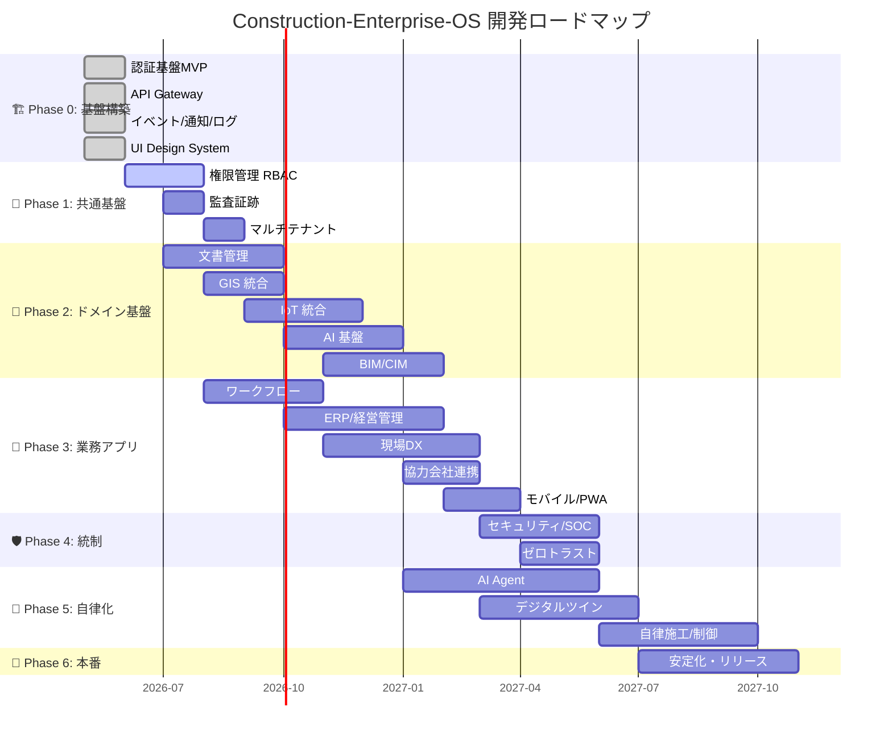
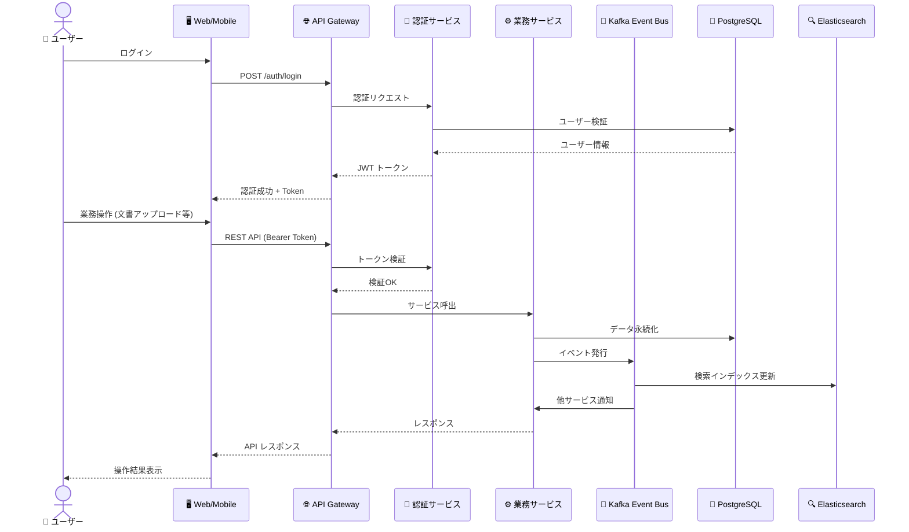
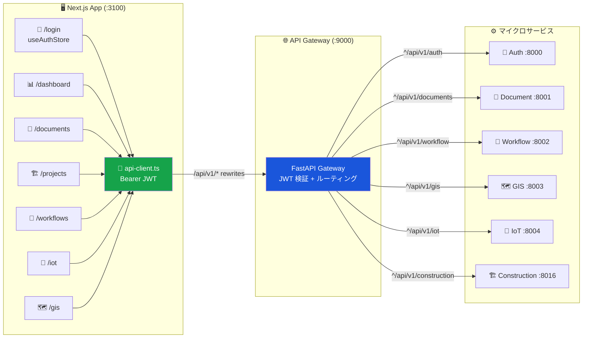

# 🏗️ Construction-Enterprise-OS

> **建設・土木業向け統合オペレーティングシステム** — 全業務・全データ・全プロセスを統合するデジタル基盤

[](https://github.com/Kensan196948G/Construction-Enterprise-OS/actions/workflows/ci.yml)
[](https://python.org)
[](https://fastapi.tiangolo.com)
[](https://nextjs.org)
[](https://postgresql.org)
[](https://kubernetes.io)
[]()

---

## 📋 概要

建設・土木業における**全業務・全データ・全プロセスを統合**するデジタル基盤です。個別バラバラの業務アプリケーション群を **「OSレイヤ」** によって統合し、単一の真実 (Single Source of Truth) として機能させます。



### 🎯 対象ユーザー

| 🏢 事業者    | 👷 現場    | 📋 管理        |
| ------------ | ---------- | -------------- |
| ゼネコン     | 現場作業員 | 経営層         |
| サブコン     | 現場監督   | 管理部門       |
| 専門工事会社 | 協力会社   | 発注者・監理者 |

---

## 🏛️ システムアーキテクチャ



---

## 🛠️ 技術スタック

| レイヤ                     | 🔧 技術                             | 📌 バージョン  |
| -------------------------- | ----------------------------------- | -------------- |
| **フロントエンド**         | React + Next.js (App Router)        | 18 / 14        |
| **UIコンポーネント**       | shadcn/ui + Radix UI + Tailwind CSS | latest         |
| **バックエンド**           | Python + FastAPI                    | 3.12 / 0.115   |
| **データベース**           | PostgreSQL + PostGIS + TimescaleDB  | 16 / 3.4 / 2.x |
| **キャッシュ**             | Redis                               | 7              |
| **メッセージキュー**       | RabbitMQ / Apache Kafka             | 3.13 / 3.7     |
| **検索エンジン**           | Elasticsearch + Kibana              | 8.14           |
| **オブジェクトストレージ** | MinIO (S3互換)                      | latest         |
| **AI/ML**                  | PyTorch + LangChain + LlamaIndex    | latest         |
| **コンテナ**               | Docker + Kubernetes                 | latest         |
| **CI/CD**                  | GitHub Actions                      | latest         |
| **モノレポ管理**           | pnpm workspaces + Turborepo         | 9 / 2.x        |

---

## 📁 プロジェクト構造

```text
construction-enterprise-os/
├── 📱 apps/                        🖥️ デプロイ可能アプリ
│   ├── web/                        Next.js フロントエンド
│   ├── admin/                      管理画面
│   └── mobile/                     PWA / モバイル
├── ⚙️ services/                    バックエンド マイクロサービス (22)
│   ├── 🔐 auth/                    統合認証基盤
│   ├── 🌐 gateway/                 API Gateway
│   ├── 📄 document/                文書管理
│   ├── 🔄 workflow/                ワークフローエンジン
│   ├── 🗺️ gis/                     GIS統合基盤
│   ├── 📡 iot/                     IoT統合基盤
│   ├── 🤖 ai/                      AI共通基盤
│   ├── 👁️ vision/                  画像AI/OCR
│   ├── 💰 erp/                     ERP経営管理
│   ├── ⛑️ safety/                  安全管理
│   ├── 🏗️ field-dx/                現場DX
│   ├── 🤝 partner/                 協力会社連携
│   ├── 🔒 security/                セキュリティ
│   ├── 🔮 maintenance/             維持管理
│   ├── 📊 analytics/               データレイク/BI
│   ├── ⚡ automation/              自動化/RPA
│   ├── 🚢 advanced/                港湾/点検/設計照査
│   ├── 🧠 autonomous/              自律化エンジン
│   ├── 🏢 platform/                共通プラットフォーム
│   ├── 🔔 notification/            統合通知
│   ├── 🏗️ bim/                     BIM/CIM基盤
│   └── 🏗️ construction/            施工管理
├── 📦 packages/                    共有パッケージ (7)
│   ├── 🎨 ui/                      共通UIコンポーネント
│   ├── 🧬 core/                    共通型定義・定数
│   ├── 🔐 auth-core/               認証共通ロジック
│   ├── 📨 event-core/              イベント共通定義
│   ├── 📊 logging/                 統合ログ基盤
│   └── 🔧 eslint/                  ESLint設定
├── ☸️ infra/                        IaC
│   ├── terraform/                  Terraform設定
│   ├── kubernetes/                 K8sマニフェスト
│   └── docker/                     Dockerfile群
├── 📚 docs/                        設計ドキュメント
│   └── architecture/               アーキテクチャ設計書
└── 🔧 scripts/                     ユーティリティ
    └── db/init/                    DB初期化スクリプト
```

---

## 📊 開発状況 — 全22サービス



| 🔢 レイヤ        | 🧩 コンポーネント   | 📁 サービス                  | 🧪 テスト | 📊 状態 |
| ---------------- | ------------------- | ---------------------------- | --------- | ------- |
| **① Foundation** | 🔐 認証基盤         | `services/auth/`             | 30        | ✅      |
|                  | 🌐 API Gateway      | `services/gateway/`          | 9         | ✅      |
|                  | 📨 イベント基盤     | `packages/event-core/`       | —         | ✅      |
|                  | 📊 共通ログ         | `packages/logging/`          | 24        | ✅      |
|                  | 🔔 共通通知         | `services/notification/`     | 13        | ✅      |
|                  | 🛡️ 権限管理 (RBAC)  | `services/auth/`             | —         | ✅      |
|                  | 📝 監査証跡         | `services/auth/`             | —         | ✅      |
|                  | 🎨 統合UI           | `packages/ui/` + `apps/web/` | —         | ✅      |
| **② Data & AI**  | 🗺️ GIS              | `services/gis/`              | 25        | ✅      |
|                  | 📄 文書管理         | `services/document/`         | 12        | ✅      |
|                  | 📡 IoT              | `services/iot/`              | 22        | ✅      |
|                  | 🤖 AI               | `services/ai/`               | 29        | ✅      |
|                  | 🏗️ BIM/CIM          | `services/bim/`              | 35        | ✅      |
|                  | 👁️ OCR/画像AI       | `services/vision/`           | 17        | ✅      |
|                  | 🧬 ベクトルDB       | `services/vision/`           | 17        | ✅      |
|                  | 🗄️ データレイク     | `services/analytics/`        | 27        | ✅      |
| **③ Platform**   | 🔄 ワークフロー     | `services/workflow/`         | 17        | ✅      |
|                  | 🔒 セキュリティ     | `services/security/`         | 23        | ✅      |
|                  | 🤝 協力会社連携     | `services/partner/`          | 21        | ✅      |
|                  | 📱 モバイル/PWA     | `apps/mobile/`               | —         | ✅      |
|                  | ⚡ 自動化/RPA       | `services/automation/`       | 12        | ✅      |
|                  | 🏢 共通PF           | `services/platform/`         | 22        | ✅      |
| **④ Business**   | 💰 ERP/経営         | `services/erp/`              | 27        | ✅      |
|                  | ⛑️ 安全管理         | `services/safety/`           | 14        | ✅      |
|                  | 🏗️ 現場DX           | `services/field-dx/`         | 20        | ✅      |
|                  | 🔮 維持管理         | `services/maintenance/`      | 18        | ✅      |
|                  | 🚢 港湾/点検        | `services/advanced/`         | 17        | ✅      |
| **⑤ Autonomous** | 🧠 AI Agent         | `services/autonomous/`       | 17        | ✅      |
|                  | 👥 デジタルツイン   | `services/autonomous/`       | 17        | ✅      |
|                  | 🎯 自動最適化       | `services/autonomous/`       | 17        | ✅      |
|                  | 🚜 自律施工         | 未着手                       | —         | ⚪      |
|                  | 🌊 海洋ロボティクス | 未着手                       | —         | ⚪      |
|                  | 🎮 自律制御         | 未着手                       | —         | ⚪      |

> **総計: 22サービス + 7パッケージ + 3アプリ = 582ファイル | 451 tests ALL PASS**

---

## 🚀 開発フェーズ ロードマップ



---

## 🗂️ データフロー概要



---

## 🖥️ WebUI → Backend API 統合アーキテクチャ



### 📋 ダッシュボードページ一覧

| 🖥️ ページ    | 📡 APIエンドポイント                 | 🔄 更新方式            | ⬛ フォールバック |
| ------------ | ------------------------------------ | ---------------------- | ----------------- |
| `/login`     | `POST /api/v1/auth/login`            | フォーム送信           | —                 |
| `/dashboard` | `/api/v1/construction/schedules`     | useEffect              | モックデータ      |
| `/documents` | `GET /api/v1/documents`              | useEffect              | モックデータ      |
| `/projects`  | `GET /api/v1/construction/schedules` | useEffect              | モックデータ      |
| `/workflows` | `GET /api/v1/workflow/instances`     | useEffect + アクション | モックデータ      |
| `/iot`       | `GET /api/v1/iot/devices`            | 30秒自動リフレッシュ   | モックデータ      |
| `/gis`       | `GET /api/v1/gis/sites`              | useEffect              | モックデータ      |

> 💡 **グレースフルフォールバック**: バックエンド未起動時はモックデータを表示するため、フロントエンド単体でも完全動作します。

---

## 🚀 クイックスタート

### 📦 前提条件

- **Node.js** >= 20 | **pnpm** >= 9
- **Python** >= 3.12
- **Docker** + Docker Compose

### ⚡ 開発環境起動

```bash
# 1. クローン
git clone https://github.com/Kensan196948G/Construction-Enterprise-OS.git
cd Construction-Enterprise-OS

# 2. インフラ起動 (PostgreSQL, Redis, Kafka, ES, MinIO)
make up
# または: docker compose up -d

# 3. Auth Service 起動
cd services/auth
cp .env.example .env
make auth-dev
# → http://localhost:8000/docs でSwagger UI表示

# 4. API Gateway 起動
cd services/gateway
uvicorn src.main:app --host 0.0.0.0 --port 9000 --reload
# → http://localhost:9000/docs

# 5. DBマイグレーション
make db-migrate

# 6. シードデータ投入
cd services/auth && python -m src.seed

# 7. Web フロントエンド起動
cd apps/web
pnpm install
pnpm dev
# → http://localhost:3100

# 8. テスト実行
make test
```

### 🔑 開発用ログイン情報

```
📧 Email:    admin@construction-enterprise-os.local
🔒 Password: AdminPass123!
```

---

## 📚 ドキュメント

| 📄 ドキュメント                                                       | 📝 内容                                       |
| --------------------------------------------------------------------- | --------------------------------------------- |
| [🏛️ 全体アーキテクチャ設計](docs/architecture/00-overview.md)         | 5レイヤ構造、開発計画、ADR                    |
| [🔐 統合認証基盤 詳細設計](docs/architecture/01-auth-platform.md)     | データモデル/API/トークン/セキュリティ        |
| [🗄️ 統合データ基盤 詳細設計](docs/architecture/02-data-platform.md)   | PostgreSQL+PostGIS+TimescaleDB/マルチスキーマ |
| [🌐 API Gateway & イベント基盤](docs/architecture/03-api-gateway.md)  | Gateway+EventBus+Webhook設計                  |
| [🎨 共通UI・通知・ログ基盤](docs/architecture/04-common-platforms.md) | Design System/通知/ログ/検索                  |

---

## 🛡️ セキュリティ

| 🔐 項目      | 🛠️ 方式              | 📋 詳細                |
| ------------ | -------------------- | ---------------------- |
| パスワード   | bcrypt               | cost >= 12             |
| JWT          | RS256 非対称鍵       | 開発環境: HS256        |
| MFA          | TOTP (RFC 6238)      | バックアップコード付き |
| ロックアウト | 5回連続失敗          | 15分ロック             |
| レート制限   | `/auth/login`        | 10回/分/IP             |
| 監査ログ     | 全認証イベント記録   | 改ざん検知             |
| API キー     | SHA-256 ハッシュ保存 | 作成時のみ平文返却     |

---

## 📜 ライセンス

**Proprietary** — All Rights Reserved

---

> 💚 **最終更新**: 2026-05-24 | 🏗️ **ビルド番号**: 18 | 🟢 **ステータス**: STABLE | 🧪 **451 tests ALL PASS** | ⚙️ **22サービス稼働中**
